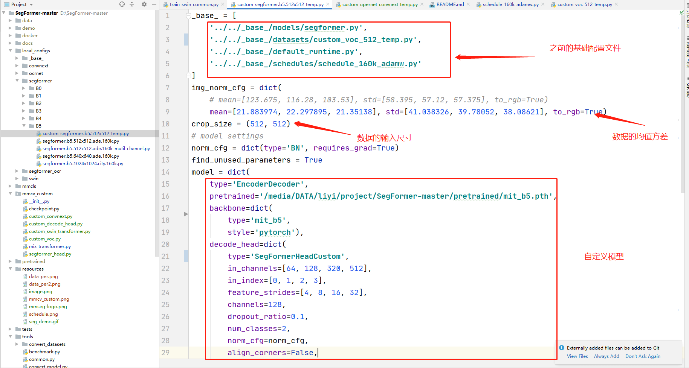
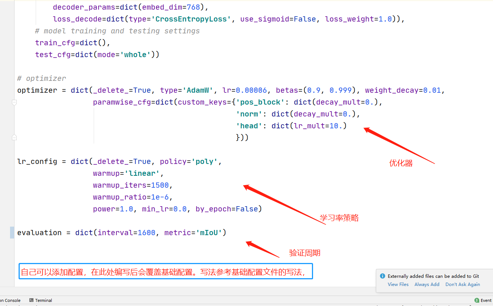
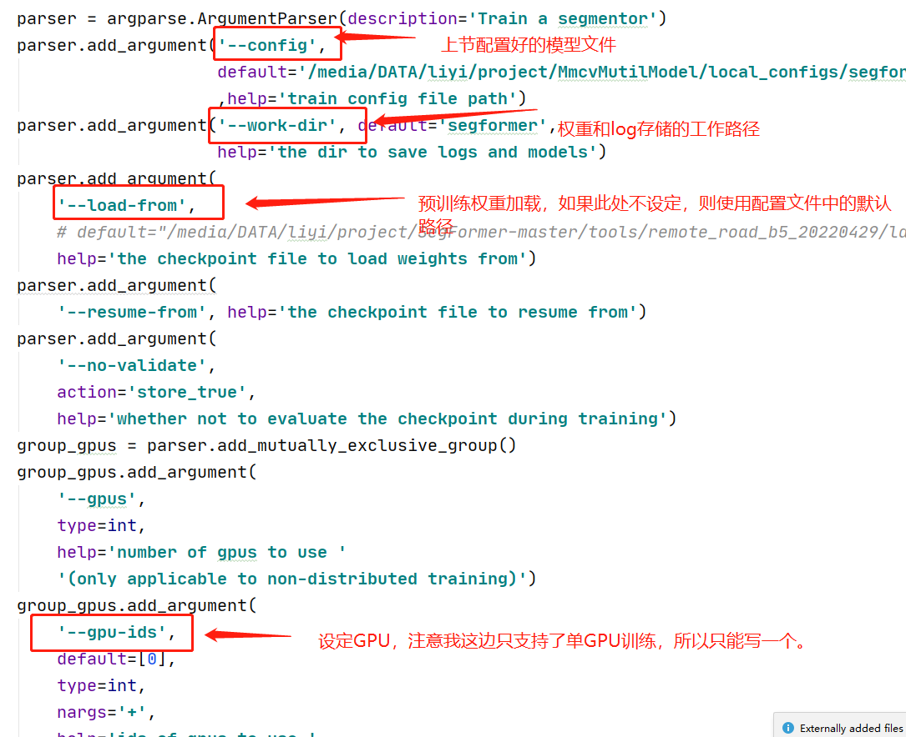

# 基于MMCV的ConvNeXt、HRNet_OCR、SegFormer、SwinTransformer网络
## 1.简介
本仓库存储的是基于MMCV环境的ConvNeXt网络、HRNet_OCR网络、SegFormer网络、SwinTransformer网络的训练和测试代码。

其中ConvNeXt网络、SegFormer网络、SwinTransformer网络都集成到自定义文件夹mmcv_custom中，如下图：

HRNet_OCR网络用的是mmseg/models/backbones中的hrnet.py。

`其实SegFormer网络和SwinTransformer网络在mmcv中都已经集成了，不过我用惯了之前的代码（和集成的有一些区别），所以仍然用mmcv_custom中的代码。`

## 2.训练环境
本仓库代码没有给出requirement.txt，我后续整理一下。

不过我也列出了我使用的环境配置，见下表。该环境中的包不一定全是用于该项目代码的，不过也可以参考一下。

>补充:
>- torch1.7也可以跑，不一定用1.10
>- 推理的时候我使用的是GDAL读图，读者可以通过如下网址进行下载安装：
>   - [Windows下GDAL whl文件网址](https://www.lfd.uci.edu/~gohlke/pythonlibs/#gdal)
>   - [Linux下GDAL whl文件网址](https://sourceforge.net/projects/gdal-wheels-for-linux/files/)

package|version
---|---
absl-py|                 1.4.0
addict|                  2.4.0
albumentations|          1.3.0
asttokens|               2.2.1
attrs|                   22.2.0
backcall|                0.2.0
cachetools|              5.3.0
certifi|                 2022.12.7
charset-normalizer|      3.0.1
click|                   8.1.3
click-plugins|           1.1.1
cligj|                   0.7.2
colorama|                0.4.6
contourpy|               1.0.7
cycler|                  0.11.0
decorator|               5.1.1
einops|                  0.6.0
executing|               1.2.0
Fiona|                   1.9.0
flatbuffers|             23.1.21
fonttools|               4.38.0
GDAL|                    3.4.1
geopandas|               0.12.2
google-auth|             2.16.0
google-auth-oauthlib|    0.4.6
grpcio|                  1.51.1
idna|                    3.4
imageio|                 2.25.0
imgaug|                  0.4.0
importlib-metadata|      6.0.0
ipython|                 8.10.0
jedi|                    0.18.2
joblib|                  1.2.0
kiwisolver|              1.4.4
Markdown|                3.4.1
markdown-it-py|          2.2.0
MarkupSafe|              2.1.2
matplotlib|              3.6.3
matplotlib-inline|       0.1.6
mdurl|                   0.1.2
mmcv-full|               1.4.7
mmdet|                   2.22.0
mmsegmentation|          0.20.2
model-index|             0.1.11
munch|                   2.5.0
networkx|                3.0
numpy|                   1.23.5
oauthlib|                3.2.2
onnxruntime-gpu|         1.8.0
opencv-python|           4.7.0.68
opencv-python-headless|  4.7.0.68
openmim|                 0.3.6
ordered-set|             4.1.0
packaging|               23.0
pandas|                  1.5.3
parso|                   0.8.3
pexpect|                 4.8.0
pickleshare|             0.7.5
Pillow|                  9.4.0
pip|                     22.3.1
prettytable|             3.6.0
prompt-toolkit|          3.0.36
protobuf|                3.20.3
ptyprocess|              0.7.0
pure-eval|               0.2.2
pyasn1|                  0.4.8
pyasn1-modules|          0.2.8
pycocotools|             2.0.6
Pygments|                2.14.0
pyparsing|               3.0.9
pyproj|                  3.4.1
pyshp|                   2.3.1
python-dateutil|         2.8.2
pytz|                    2022.7.1
PyWavelets|              1.4.1
PyYAML|                  6.0
qudida|                  0.0.4
requests|                2.28.2
requests-oauthlib|       1.3.1
rich|                    13.3.2
rsa|                     4.9
scikit-image|            0.19.3
scikit-learn|            1.2.1
scipy|                   1.10.0
setuptools|              59.5.0
shapely|                 2.0.1
six|                     1.16.0
sklearn|                 0.0.post1
stack-data|              0.6.2
tabulate|                0.9.0
tensorboard|             2.11.2
tensorboard-data-server| 0.6.1
tensorboard-plugin-wit|  1.8.1
terminaltables|          3.1.10
threadpoolctl|           3.1.0
tifffile|                2023.1.23.1
timm|                    0.4.12
torch|                   1.10.0+cu113
torchaudio|              0.10.0+cu113
torchvision|             0.11.0+cu113
tqdm|                    4.64.1
traitlets|               5.9.0
typing_extensions|       4.4.0
urllib3|                 1.26.14
wcwidth|                 0.2.6
Werkzeug|                2.2.2
wheel|                   0.37.1
yapf|                    0.32.0
zipp|                    3.12.0

## 3.训练过程
### （1）数据配置文件准备

`写在前面，目前我只提供了voc的自定义模板，读者可以自己在其他数据集格式的基础上进行修改。`

1)修改local_config/\_base\_/datasets/custom_voc_512_temp.py中的相关数据参数。如下图

>samples_per_gpu指的是batch_size。
>
>workers_per_gpu我目前还没弄明白，但是必须是偶数。

>**如图中所说，local_config/\_base\_/datasets中的配置会被高级配置文件（例如：local_config/segformer/B5/custom_segformer.b5.512x512_temp.py）覆盖**

2)local_config/\_base\_/models中存储的都是模型最基础的文件配置，一般都会被高级模型参数覆盖，所以不用修改。

3)local_config/\_base\_/schedules中存储的是模型的优化器，学习策略，迭代周期，验证周期和保存权重周期，仍然也会被高级配置文件覆盖。如下图所示：

4)修改最终的配置文件，以local_config/segformer/B5/custom_segformer.b5.512x512_temp.py为例，该配置文件权限最高，会覆盖之前的配置文件。

5)修改数据的颜色参数和后缀，在mmcv_custom/custom_voc.py，如下图所示：

>至此数据的修改内容已经完成，我分别提供了ConvNeXt网络、HRNet_OCR网络、SegFormer网络、SwinTransformer网络的VOC数据模板，读者可以在这个基础上修改：
>
>./local_configs/convnext/custom_upernet_convnext_temp.py
>
>./local_configs/ocrnet/ocrnet_hr48_temp.py
>
>./local_configs/segformer/B5/custom_segformer.b5.512x512_temp.py
>
>./local_configs/swin/custom_upernet_swin_temp.py

###（2）训练脚本的配置
以./tools/train_segformer_common.py为例子。修改其中的参数，如下图：

>如上图中所示：脚本只支持单gpu

>我已经提供了每个网络的训练脚本模板,读者朋友可以在原来的基础上自行修改：
>
>./tools/train_segformer_common.py
>
>./tools/train_hrnet_ocr_common.py
>
>./tools/train_swin_common.py
>
>./tools/train_convnext_common.py

###（3）测试脚本的配置
文件为：./tools/predict_common.py

本测试脚本是针对遥感大图的推理。通过滑框裁剪图像然后送入网络进行推理，最后会生成单波段的预测图，里面的值为(0,1,2...)，以及一个shp的矢量图。

>读者朋友如果不想使用该脚本，可以自行修改tools/test.py，或者参考demo文件中的image_demo.py中的推理写法编写自己的脚本。

测试脚本的配置参数为：

## 4.预训练权重

模型名称|权重路径
---|---
swin| 后续补充
convnext|[链接：https://pan.baidu.com/s/15C9ULK80rZl0rMfud_MaKQ 提取码：1234](https://pan.baidu.com/s/15C9ULK80rZl0rMfud_MaKQ)
hrnet|[链接：https://pan.baidu.com/s/1Bcgj-jEkTMroPijzU8z-Rw 提取码：1234](https://pan.baidu.com/s/1Bcgj-jEkTMroPijzU8z-Rw)
segformer|[链接：https://pan.baidu.com/s/1k8sMdsRFRBerlSNULuGXcQ 提取码：1234](https://pan.baidu.com/s/1k8sMdsRFRBerlSNULuGXcQ)
